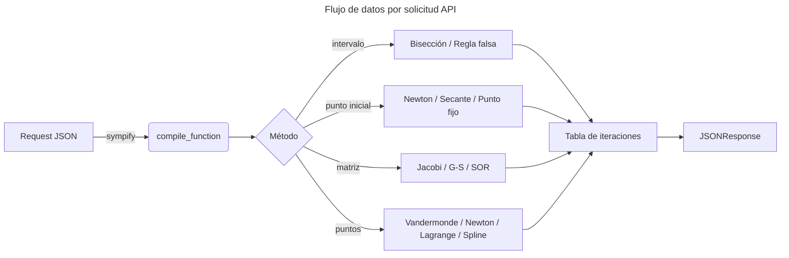
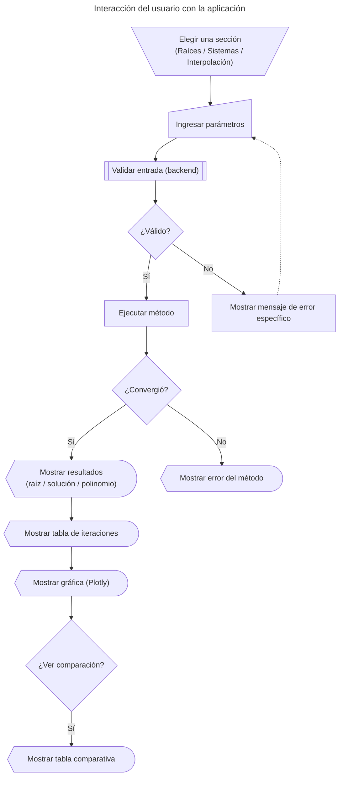

# Métodos Numéricos · Laboratorio

Aplicación web fullstack para explorar y ejecutar métodos numéricos clásicos en tres categorías:

1. **Raíces de ecuaciones** de una variable (ej. Newton-Raphson, bisección)
2. **Sistemas lineales** de ecuaciones mediante técnicas iterativas (ej. Gauss-Seidel)
3. **Interpolación polinómica** (ej. polinomio de Lagrange, splines cúbicos)

El backend implementa todos los algoritmos desde cero en Python, sin depender de librerías de alto nivel como `scipy`. El frontend es una SPA liviana en HTML/CSS/JS vanilla que se comunica con el backend a través de una API REST y visualiza resultados con gráficas interactivas.

---

# Tabla de contenidos 

- [1. Métodos implementados](#1-métodos-implementados)
  - [1.1. Ecuaciones de una variable](#11-ecuaciones-de-una-variable)
  - [1.2. Sistemas lineales iterativos](#12-sistemas-lineales-iterativos)
  - [1.3. Interpolación](#13-interpolación)
- [2. Tech stack](#2-tech-stack)
- [3. Arquitectura del proyecto](#3-arquitectura-del-proyecto)
- [4. Ejecutar el proyecto](#4-ejecutar-el-proyecto)
  - [4.1. Requisitos previos](#41-requisitos-previos)
  - [4.2. Instalación y arranque](#42-instalación-y-arranque)
- [5. Estructura de carpetas](#5-estructura-de-carpetas)
- [6. API Reference](#6-api-reference)
  - [6.1. Formato de respuesta común](#61-formato-de-respuesta-común)
  - [6.2. Ecuaciones de una variable — endpoints](#62-ecuaciones-de-una-variable--endpoints)
  - [6.3. Sistemas lineales — endpoints](#63-sistemas-lineales--endpoints)
  - [6.4. Interpolación — endpoints](#64-interpolación--endpoints)
- [7. Formatos de entrada y salida](#7-formatos-de-entrada-y-salida)
  - [7.1. Ecuaciones de una variable](#71-ecuaciones-de-una-variable)
  - [7.2. Sistemas lineales](#72-sistemas-lineales)
  - [7.3. Interpolación](#73-interpolación)
- [8. Funcionalidades](#8-funcionalidades)
- [9. Comparación de métodos](#9-comparación-de-métodos)
- [10. Representación interna](#10-representación-interna)
- [11. Flujo de interacción del usuario](#11-flujo-de-interacción-del-usuario)
- [12. Capturas de pantalla](#12-capturas-de-pantalla)
- [13. Limitaciones y particularidades conocidas](#13-limitaciones-y-particularidades-conocidas)
- [14. Documentación de algoritmos](#14-documentación-de-algoritmos)
- [15. Sobre este proyecto](#15-sobre-este-proyecto)
- [16. Referencias](#16-referencias)
- [17. Autores](#17-autores)
- [18. Proyectos similares](#18-proyectos-similares)
- [19. Licencia](#19-licencia)

---

# 1. Métodos implementados

## 1.1. Ecuaciones de una variable

> Uno de los problemas más básicos de la aproximación numérica es el problema
> de encontrar raíces: encontrar una raíz, o solución, de una ecuación de la
> forma $f(x) = 0$ para una función $f$ dada. Una raíz de esta ecuación también
> se denomina **cero** de la función $f$.
>
> — Burden & Faires (2011, p. 48)

El programa admite expresiones matemáticas simbólicas en `x`. Se soportan operadores estándar (`^`, `*`, `/`, `+`, `-`) y las funciones `sin`, `cos`, `tan`, `exp`, `log`, `sqrt`, `abs`, así como las constantes `pi` y `e`.

| # | Método | Tipo de entrada | Descripción breve |
|---|--------|-----------------|-------------------|
| 1 | **Bisección** | Intervalo $[a, b]$ | Divide el intervalo a la mitad en cada iteración; garantiza convergencia si $f(a) \cdot f(b) < 0$ |
| 2 | **Regla falsa** *(regula falsi)* | Intervalo $[a, b]$ | Como bisección, pero la nueva aproximación se calcula por interpolación lineal |
| 3 | **Punto fijo** | Valor inicial $x_0$, función $g(x)$ | Convierte $f(x)=0$ en $x = g(x)$ e itera; converge si $\lvert g'(x)\rvert < 1$ cerca de la raíz |
| 4 | **Newton-Raphson** | Valor inicial $x_0$ | Usa la derivada simbólica $f'(x)$ (calculada con SymPy) para convergencia cuadrática |
| 5 | **Secante** | Dos valores iniciales $x_0$, $x_1$ | Similar a Newton-Raphson pero aproxima la derivada con diferencias finitas |
| 6 | **Newton modificado** *(raíces múltiples)* | Valor inicial $x_0$, multiplicidad $m$ | Modifica Newton-Raphson para tratar raíces con multiplicidad $m > 1$ |

> **Nota:** La derivada simbólica se computa automáticamente con `sympy.diff()`. El usuario no necesita ingresarla.

## 1.2. Sistemas lineales iterativos

> Una técnica iterativa para resolver el sistema lineal $n \times n$
> $A\vec{x} = \vec{b}$ parte de una aproximación inicial $\vec{x}^{(0)}$ y
> genera una sucesión $\{\vec{x}^{(k)}\}_{k=0}^{\infty}$ que converge a $\vec{x}$.
>
> — Burden & Faires (2011, p. 450)

El programa implementa exclusivamente técnicas **iterativas**. El tamaño del sistema está restringido a $2 \leq n \leq 7$.

| # | Método | Descripción breve |
|---|--------|-------------------|
| 1 | **Jacobi** | Actualiza todas las componentes de $\vec{x}$ simultáneamente usando los valores de la iteración anterior |
| 2 | **Gauss-Seidel** | Actualiza cada componente de $\vec{x}$ usando inmediatamente los valores ya calculados en la misma iteración |
| 3 | **SOR** *(Successive Over-Relaxation)* | Extensión de Gauss-Seidel con factor de relajación $\omega \in (0, 2)$ |

La convergencia se mide con la norma infinito $\|\vec{x}^{(k)} - \vec{x}^{(k-1)}\|_\infty$.

## 1.3. Interpolación

> El problema de determinar un polinomio de grado $n$ que pase por $n+1$ puntos
> distintos se denomina **interpolación polinómica**.
>
> — Burden & Faires (2011, p. 108)

El programa interpola un máximo de **8 puntos**. Además del conjunto de puntos, el usuario proporciona un punto adicional de evaluación $x_{\text{eval}}$ para calcular el error respecto al valor exacto esperado.

| # | Método | Descripción breve |
|---|--------|-------------------|
| 1 | **Vandermonde** | Resuelve el sistema $V\vec{c} = \vec{y}$ para obtener los coeficientes del polinomio |
| 2 | **Diferencias divididas de Newton** | Construye el polinomio en forma de Newton usando la tabla de diferencias divididas |
| 3 | **Lagrange** | $P(x) = \sum_{i} y_i L_i(x)$, donde $L_i(x) = \prod_{j \neq i} \frac{x - x_j}{x_i - x_j}$ |
| 4 | **Spline lineal** | Interpolación lineal por tramos; continua pero no diferenciable en los nodos |
| 5 | **Spline cúbico natural** | Polinomios de grado 3 por tramos con continuidad $C^2$ y condiciones de frontera natural ($S''=0$ en extremos) |

---

# 2. Tech stack

## Backend

| Tecnología | Versión | Rol |
|------------|---------|-----|
| **Python** | 3.10+ | Lenguaje del backend |
| **FastAPI** | 0.115.0 | Framework web; expone la API REST; genera documentación OpenAPI automáticamente |
| **Uvicorn** | 0.30.6 | Servidor ASGI; sirve la aplicación y los archivos estáticos del frontend |
| **NumPy** | 1.26.4 | Operaciones vectoriales y matriciales para los métodos iterativos |
| **SymPy** | 1.13.3 | Parsing simbólico de expresiones matemáticas; cómputo automático de derivadas |

## Frontend

| Tecnología | Versión | Rol |
|------------|---------|-----|
| **HTML5 / CSS3** | — | Marcado semántico y diseño responsivo |
| **JavaScript** (vanilla) | ES2022 | Lógica de UI, llamadas a la API (`fetch`), renderizado de tablas y resultados |
| **Plotly.js** | 2.30.0 | Gráficas interactivas de funciones e interpolaciones (cargado vía CDN) |
| **mathjs** | 12.4.1 | Parsing de expresiones matemáticas del lado del cliente para previsualización (cargado vía CDN) |
| **Google Fonts** | — | Tipografías Fraunces, IBM Plex Mono, Quicksand |

---

# 3. Arquitectura del proyecto

```
┌─────────────────────────────────────────────────────────────────┐
│                          Navegador                              │
│                                                                 │
│   frontend/index.html  ──  frontend/styles.css                 │
│              └──  frontend/app.js                               │
│                      │                                          │
│            fetch  POST /api/...                                 │
└──────────────────────┼──────────────────────────────────────────┘
                       │ HTTP (JSON)
┌──────────────────────┼──────────────────────────────────────────┐
│                 FastAPI  (puerto 3000)                          │
│                                                                 │
│   /api/single/{method}   →  methods/single_variable/           │
│   /api/linear/{method}   →  methods/linear_systems/            │
│   /api/interpolation/{method} → methods/interpolation/         │
│   /api/health                                                   │
│                                                                 │
│   backend-python/utils.py  (SymPy parser, eliminación Gauss)   │
└─────────────────────────────────────────────────────────────────┘
```

**Principios de diseño:**
- El frontend es completamente **sin estado** (*stateless*): solo gestiona la UI y delega todo cómputo al backend.
- Todos los algoritmos están **implementados desde cero**; no se usa `scipy.linalg`, `scipy.optimize` ni `scipy.interpolate`.
- La evaluación de expresiones del usuario es **segura**: las expresiones pasan por `sympy.sympify()` antes de ejecutarse, evitando `eval()` desnudo.
- El mismo servidor Uvicorn sirve tanto la API como los archivos estáticos del frontend.

---

# 4. Ejecutar el proyecto

## 4.1. Requisitos previos

- Python 3.10 o superior (verificar con `python --version`)
- Conexión a internet la primera vez (para que Plotly y mathjs se carguen desde CDN)

## 4.2. Instalación y arranque

El entorno virtual y las dependencias van **dentro de `backend-python/`**.

### Windows (PowerShell)

```powershell
# 1. Entrar a la carpeta del backend
cd backend-python

# 2. Crear el entorno virtual
python -m venv .venv

# 3. Activar el entorno virtual  ← el prompt debe mostrar (.venv)
.venv\Scripts\Activate.ps1

# 4. Instalar dependencias
pip install -r requirements.txt

# 5. Arrancar el servidor
python main.py
```

### macOS / Linux

```bash
# 1. Entrar a la carpeta del backend
cd backend-python

# 2. Crear el entorno virtual
python3 -m venv .venv

# 3. Activar el entorno virtual  ← el prompt debe mostrar (.venv)
source .venv/bin/activate

# 4. Instalar dependencias
pip install -r requirements.txt

# 5. Arrancar el servidor
python main.py
```

Abrir en el navegador: **http://localhost:3000** (no uses `http://0.0.0.0:3000` — esa dirección no funciona en el navegador en Windows)

> **Errores frecuentes:**
> - `ModuleNotFoundError: No module named 'fastapi'` → el paso 4 (`pip install`) no se ejecutó, o el entorno virtual no está activo. El prompt debe mostrar `(.venv)`.
> - `ERR_ADDRESS_INVALID` en el navegador → estás intentando abrir `http://0.0.0.0:3000`; usa `http://localhost:3000` en su lugar.
> - `.venv\Scripts\Activate.ps1 cannot be loaded` (Windows) → ejecutar primero `Set-ExecutionPolicy -Scope CurrentUser RemoteSigned` y volver a intentar.

## 4.3. Recarga automática (desarrollo)

Con el entorno virtual activado y dentro de `backend-python/`:

```bash
uvicorn main:app --host 0.0.0.0 --port 3000 --reload
```

El servidor se reinicia automáticamente cada vez que se guarda un archivo Python.

> La documentación interactiva de la API (Swagger UI) está disponible en **http://localhost:3000/docs**.

---

# 5. Estructura de carpetas

```
Interfaz-Grafica/
│
├── backend-python/
│   ├── main.py                    ← Entrada del servidor FastAPI; rutas y CORS
│   ├── utils.py                   ← Parser SymPy, norma infinito, eliminación gaussiana
│   ├── requirements.txt
│   │
│   ├── methods/
│   │   ├── single_variable/
│   │   │   ├── bisection.py
│   │   │   ├── false_position.py
│   │   │   ├── fixed_point.py
│   │   │   ├── newton_raphson.py
│   │   │   ├── secant.py
│   │   │   ├── multiple_roots.py
│   │   │   ├── common.py          ← Formateadores de respuesta compartidos
│   │   │   └── compare.py         ← Ejecuta los 4 métodos comparables en paralelo
│   │   │
│   │   ├── linear_systems/
│   │   │   ├── jacobi.py
│   │   │   ├── gauss_seidel.py
│   │   │   ├── sor.py
│   │   │   ├── common.py          ← Iterador unificado para los tres métodos
│   │   │   └── compare.py         ← Jacobi + Gauss-Seidel + SOR con ω ∈ {0.8, 1.0, 1.2}
│   │   │
│   │   └── interpolation/
│   │       ├── vandermonde.py
│   │       ├── newton_interpolation.py
│   │       ├── lagrange.py
│   │       ├── spline.py
│   │       ├── spline_cubic.py
│   │       ├── common.py          ← Validación de puntos, evaluación de polinomios
│   │       └── compare.py         ← Ejecuta los 5 métodos de interpolación
│   │
│   └── docs/                      ← Documentación por algoritmo (Markdown)
│       ├── README.md              ← Índice
│       ├── single_variable/       ← 6 archivos .md
│       ├── linear_systems/        ← 3 archivos .md
│       └── interpolation/         ← 5 archivos .md
│
└── frontend/
    ├── index.html                 ← SPA con 4 paneles: Raíces, Sistemas, Interpolación, Docs
    ├── styles.css                 ← Diseño responsivo, tipografías, gradientes
    ├── app.js                     ← Lógica de UI: llamadas API, Plotly, tablas
    └── assets/
        └── just-the-way-you-are.mp3  ← Música de fondo (opcional)
```

---

# 6. API Reference

Todos los endpoints aceptan y devuelven `application/json`. El método HTTP es siempre `POST` (excepto el health check).

## 6.1. Formato de respuesta común

Todos los métodos devuelven un objeto con esta estructura base:

```jsonc
{
  "success": true,          // false si hubo error
  "method": "Bisección",    // nombre legible del método
  "root": 1.5213,           // solución encontrada (null si no convergió)
  "iterations": 24,         // número de iteraciones ejecutadas
  "error": 8.3e-8,          // error final (absoluto o relativo)
  "table": [                // historial de iteraciones
    { "k": 0, "x": 1.5, "fx": -0.125, "error": null },
    { "k": 1, "x": 1.53125, "fx": 0.044, "error": 0.03125 }
    // ...
  ]
}
```

En caso de error:

```jsonc
{
  "success": false,
  "error": "Descripción del problema encontrado"
}
```

## 6.2. Ecuaciones de una variable — endpoints

| Endpoint | Método | Descripción |
|----------|--------|-------------|
| `POST /api/single/bisection` | Bisección | Requiere `fn`, `a`, `b`, `tol`, `maxIter` |
| `POST /api/single/falsePosition` | Regla falsa | Requiere `fn`, `a`, `b`, `tol`, `maxIter` |
| `POST /api/single/fixedPoint` | Punto fijo | Requiere `fn`, `gfn`, `x0`, `tol`, `maxIter` |
| `POST /api/single/newton` | Newton-Raphson | Requiere `fn`, `x0`, `tol`, `maxIter` |
| `POST /api/single/secant` | Secante | Requiere `fn`, `x0`, `x1`, `tol`, `maxIter` |
| `POST /api/single/modifiedNewtonMultiplicity` | Newton modificado | Requiere `fn`, `x0`, `m`, `tol`, `maxIter` |
| `POST /api/single/compareSingle` | Comparación | Ejecuta bisección, regla falsa, Newton y secante con las mismas entradas |

## 6.3. Sistemas lineales — endpoints

| Endpoint | Método | Descripción |
|----------|--------|-------------|
| `POST /api/linear/jacobi` | Jacobi | Requiere `A`, `b`, `x0`, `tol`, `maxIter` |
| `POST /api/linear/gaussSeidel` | Gauss-Seidel | Requiere `A`, `b`, `x0`, `tol`, `maxIter` |
| `POST /api/linear/sor` | SOR | Requiere `A`, `b`, `x0`, `omega`, `tol`, `maxIter` |
| `POST /api/linear/compareLinear` | Comparación | Ejecuta Jacobi, Gauss-Seidel y SOR (ω ∈ {0.8, 1.0, 1.2}) |

## 6.4. Interpolación — endpoints

| Endpoint | Método | Descripción |
|----------|--------|-------------|
| `POST /api/interpolation/vandermonde` | Vandermonde | Requiere `points`, `evalX` |
| `POST /api/interpolation/dividedDifferences` | Diferencias divididas | Requiere `points`, `evalX` |
| `POST /api/interpolation/lagrange` | Lagrange | Requiere `points`, `evalX` |
| `POST /api/interpolation/linearSpline` | Spline lineal | Requiere `points`, `evalX` |
| `POST /api/interpolation/cubicSpline` | Spline cúbico natural | Requiere `points`, `evalX` |
| `POST /api/interpolation/compareInterpolation` | Comparación | Ejecuta los 5 métodos |

---

# 7. Formatos de entrada y salida

## 7.1. Ecuaciones de una variable

**Entrada (ejemplo: Newton-Raphson):**

```json
{
  "fn": "x^3 - x - 2",
  "x0": 1.5,
  "tol": 1e-7,
  "maxIter": 100
}
```

**Expresiones soportadas en `fn` y `gfn`:**

| Operación | Sintaxis |
|-----------|----------|
| Potencia | `x^2`, `x**2` |
| Multiplicación implícita | `2x` equivale a `2*x` |
| Funciones trigonométricas | `sin(x)`, `cos(x)`, `tan(x)` |
| Funciones exponenciales/logarítmicas | `exp(x)`, `log(x)` |
| Raíz cuadrada / valor absoluto | `sqrt(x)`, `abs(x)` |
| Constantes | `pi`, `e` |

**Restricciones:**
- `tol` debe ser positivo (recomendado: $10^{-7}$)
- `maxIter` máximo: 1000
- Para bisección y regla falsa: $f(a) \cdot f(b) < 0$ (cambio de signo en el intervalo)
- Para punto fijo: $\lvert g'(x_0) \rvert < 1$ para garantizar convergencia

## 7.2. Sistemas lineales

**Entrada:**

```json
{
  "A": [
    [10, -1,  2,  0],
    [-1, 11, -1,  3],
    [ 2, -1, 10, -1],
    [ 0,  3, -1,  8]
  ],
  "b": [6, 25, -11, 15],
  "x0": [0, 0, 0, 0],
  "tol": 1e-7,
  "maxIter": 300
}
```

Para SOR se agrega el campo `"omega"` (número real en $(0, 2)$).

**Restricciones:**
- $2 \leq n \leq 7$ (tamaño del sistema)
- `A` debe ser cuadrada y `b`, `x0` de longitud $n$
- La diagonal de `A` no puede tener ceros (división en el paso iterativo)
- La convergencia no está garantizada si `A` no es diagonalmente dominante

**Salida adicional para sistemas:**

```jsonc
{
  "success": true,
  "x": [1.0, 2.0, -1.0, 1.0],   // vector solución
  "iterations": 15,
  "error": 4.2e-8,               // norma infinito del último incremento
  "table": [
    { "k": 1, "x": [0.6, 2.27, -1.1, 1.87], "error": 1.87 }
    // ...
  ]
}
```

## 7.3. Interpolación

**Entrada:**

```json
{
  "points": [
    {"x": 1.0, "y": 0.7651977},
    {"x": 1.3, "y": 0.6200860},
    {"x": 1.6, "y": 0.4554022},
    {"x": 1.9, "y": 0.2818186},
    {"x": 2.2, "y": 0.1103623}
  ],
  "evalX": 1.5
}
```

**Restricciones:**
- Mínimo 2 puntos, máximo 8 puntos
- Los valores de `x` deben ser **distintos** (no puede haber nodos repetidos)
- `evalX` puede estar fuera del rango de los puntos (extrapolación), aunque la precisión disminuye

**Salida adicional para interpolación (varía por método):**

```jsonc
{
  "success": true,
  "polynomial": "0.51428571x^4 + ...",  // representación del polinomio (métodos globales)
  "evalResult": 0.5118199,              // P(evalX)
  "dividedDiffTable": [...],            // solo Newton: tabla de diferencias divididas
  "lagrangeTerms": [...],               // solo Lagrange: términos L_i(x) individuales
  "segments": [...]                     // solo splines: coeficientes por tramo
}
```

---

# 8. Funcionalidades

### Sistema de ayuda contextual
Cada campo de entrada tiene un botón `?` que despliega un tooltip explicando qué espera ese campo, con ejemplos concretos. El tooltip se cierra con `Esc` o haciendo clic fuera.

### Ejemplos precargados
Un menú desplegable en cada sección permite cargar casos de prueba predefinidos y convergentes con un solo clic, facilitando la exploración rápida del programa.

### Validación de entrada con mensajes específicos
El backend valida exhaustivamente cada parámetro antes de ejecutar el método. Los errores están redactados en lenguaje natural:

| Mensaje | Causa |
|---------|-------|
| `"La función produjo un número complejo."` | El resultado de $f(x)$ tiene parte imaginaria en ese punto |
| `"La función no está definida o no es continua en ese punto."` | Resultado infinito o NaN |
| `"El sistema debe tener tamaño entre 2 y 7."` | Dimensión de la matriz fuera del rango admitido |
| `"La matriz es singular o casi singular."` | El sistema lineal no tiene solución única |
| `"Expresión inválida: ..."` | La expresión matemática no pudo ser parseada por SymPy |

### Graficación de resultados
Al obtener una raíz, el frontend grafica $f(x)$ en torno al intervalo de búsqueda usando Plotly, con una línea vertical marcando la raíz encontrada. Para interpolación, se grafican los puntos originales y la curva interpolada superpuesta.

### Tabla de iteraciones
Cada ejecución devuelve el historial completo de iteraciones: el valor de $x^{(k)}$, $f(x^{(k)})$ (para métodos de una variable) y el error en cada paso.

### Comparación de métodos
Disponible en las tres secciones. Con un solo clic, el programa ejecuta todos los métodos aplicables con las mismas entradas y presenta una tabla resumen (ver §9).

### Pestaña de documentación
El panel "Documentación" enlaza directamente a los 14 archivos Markdown del directorio `backend-python/docs/`, uno por algoritmo, con formulación matemática, pseudocódigo y condiciones de uso.

### Música de fondo
Si el archivo `frontend/assets/just-the-way-you-are.mp3` está presente, la interfaz muestra un botón para activar música de fondo.

---

# 9. Comparación de métodos

## Ecuaciones de una variable

El endpoint `compareSingle` ejecuta bisección, regla falsa, Newton-Raphson y secante con las mismas entradas y devuelve una tabla resumen:

| Método | $x_{\text{sol}}$ | $n_{\text{iter}}$ | $E_{\text{final}}$ |
|--------|------------------|--------------------|---------------------|
| Bisección | — | — | — |
| Regla falsa | — | — | — |
| Newton-Raphson | — | — | — |
| Secante | — | — | — |

> Los valores reales dependen de la función y los parámetros ingresados.

Los métodos que requieren un intervalo se adaptan automáticamente si el usuario solo proporcionó un punto inicial (se construye un intervalo heurístico), y viceversa.

## Sistemas lineales

El endpoint `compareLinear` ejecuta Jacobi, Gauss-Seidel y SOR con $\omega \in \{0.8,\, 1.0,\, 1.2\}$:

| Método | $n_{\text{iter}}$ | $x_1$ | $x_2$ | ... | $x_n$ | $E$ |
|--------|-------------------|-------|-------|-----|-------|-----|
| Jacobi | — | — | — | ... | — | — |
| Gauss-Seidel | — | — | — | ... | — | — |
| SOR ($\omega=0.8$) | — | — | — | ... | — | — |
| SOR ($\omega=1.0$) | — | — | — | ... | — | — |
| SOR ($\omega=1.2$) | — | — | — | ... | — | — |

## Interpolación

El endpoint `compareInterpolation` ejecuta los 5 métodos de interpolación y compara el valor $P(x_{\text{eval}})$ de cada uno, junto con el polinomio generado.

---

# 10. Representación interna



**Utilidades compartidas (`utils.py`):**

| Función | Descripción |
|---------|-------------|
| `compile_function(expr)` | Parsea una expresión con SymPy y devuelve una función Python callable. Rechaza resultados complejos o no finitos. |
| `derivative_function(expr, order)` | Calcula la derivada simbólica de orden `order` y la devuelve como función callable. |
| `norm_inf(v)` | Norma infinito $\|v\|_\infty = \max_i \lvert v_i \rvert$ de un vector NumPy. |
| `validate_linear(A, b, x0)` | Verifica dimensiones y tipos para sistemas lineales antes de iterar. |
| `solve_linear_system(A, b)` | Eliminación gaussiana con pivoteo parcial para el método de Vandermonde. |
| `poly_string(coefs)` | Convierte un array de coeficientes en una cadena legible como `3.5x^2 + 1.2x - 0.8`. |

---

# 11. Flujo de interacción del usuario



---

# 12. Capturas de pantalla

> Las capturas deben guardarse en `docs/images/` y actualizarse con cada cambio relevante de UI.
> A continuación se indica qué capturar en cada caso.

## Pantalla principal

> 

> Vista completa de la aplicación al abrir `http://localhost:3000`.
> Debe mostrar: encabezado con el título "Métodos numéricos", la barra de navegación con las cuatro pestañas (Raíces, Sistemas lineales, Interpolación, Documentación), y el panel activo de "Raíces".


## Sección Raíces — entrada

> 

> Panel de "Raíces" con los campos completados para ejecutar, por ejemplo, Newton-Raphson sobre $f(x) = x^3 - x - 2$. Idealmente con el tooltip `?` abierto sobre el campo `f(x)`.


## Sección Raíces — resultado y gráfica

> 

> Resultado de Newton-Raphson: bloque resumen con la raíz encontrada, número de iteraciones y error final. Incluir la tabla de iteraciones y la gráfica de Plotly con la curva de la función y la línea vertical en la raíz.


## Sección Sistemas lineales — entrada

> 

> Panel de "Sistemas lineales" con la matriz $A$, el vector $b$, el vector inicial $x_0$, tolerancia y el método seleccionado (ej. Gauss-Seidel).


## Sección Sistemas lineales — resultado

> 

> Resultado con el vector solución $\vec{x}$, número de iteraciones y tabla de iteraciones con la norma infinito del error por paso.


## Sección Interpolación — entrada

> 

> Panel de "Interpolación" con los puntos ingresados como tabla, el valor de evaluación $x_{\text{eval}}$ y el método seleccionado (ej. Spline cúbico natural).


## Sección Interpolación — resultado y gráfica

>

> Resultado con el polinomio interpolante, la evaluación en $x_{\text{eval}}$, y la gráfica con los puntos originales y la curva interpolada superpuesta.


## Tabla de comparación de métodos

> 

> La tabla comparativa generada al pulsar "Comparar métodos" en cualquiera de las tres secciones, mostrando todos los métodos aplicables con sus resultados lado a lado.


## Pestaña de documentación

> 

> El panel "Documentación" mostrando los enlaces a los 14 archivos de documentación agrupados por categoría.


---

# 13. Limitaciones y particularidades conocidas

### Operación exclusiva en los reales
El programa no busca raíces en los números complejos. Si una evaluación intermedia produce un resultado con parte imaginaria (por ejemplo, $\sqrt{-1}$), se lanza un error y la iteración se detiene con el mensaje `"La función produjo un número complejo."`.

### Tamaño del sistema lineal restringido a 7×7
La interfaz no permite ingresar matrices mayores a 7×7. Esta es una decisión de diseño.

### Máximo de 8 puntos para interpolación
Con más puntos, el grado del polinomio crece y puede aparecer el fenómeno de Runge (oscilaciones no deseadas en los extremos del intervalo). El spline cúbico es más estable para conjuntos grandes de puntos, pero el límite se mantiene en 8 en esta versión.

### Convergencia no garantizada para sistemas no diagonalmente dominantes
Los métodos iterativos (Jacobi, Gauss-Seidel, SOR) solo tienen garantía de convergencia si la matriz $A$ es estrictamente diagonalmente dominante o definida positiva. Para matrices que no cumplen estas condiciones, el programa puede divergir o agotar las iteraciones máximas.

### Límite de 1000 iteraciones
Todos los métodos tienen un tope de 1000 iteraciones como salvaguarda. Si se alcanza sin converger, el método reporta falla con el error registrado hasta ese punto.

### Expresiones evaluadas durante la ejecución, no antes
El parser de SymPy acepta la expresión si es sintácticamente válida, pero no verifica de antemano la continuidad en todo el intervalo. Los errores de dominio (discontinuidades, valores imaginarios) se detectan en tiempo de ejecución, durante la iteración.

---

# 14. Documentación de algoritmos

Cada método tiene su propia página de documentación en `backend-python/docs/`, con formulación matemática, pseudocódigo, criterios de convergencia y condiciones de uso.

## Ecuaciones de una variable
- [Bisección](backend-python/docs/single_variable/bisection.md)
- [Regla falsa](backend-python/docs/single_variable/false_position.md)
- [Punto fijo](backend-python/docs/single_variable/fixed_point.md)
- [Newton-Raphson](backend-python/docs/single_variable/newton_raphson.md)
- [Secante](backend-python/docs/single_variable/secant.md)
- [Newton modificado (raíces múltiples)](backend-python/docs/single_variable/multiple_roots.md)

## Sistemas lineales
- [Jacobi](backend-python/docs/linear_systems/jacobi.md)
- [Gauss-Seidel](backend-python/docs/linear_systems/gauss_seidel.md)
- [SOR](backend-python/docs/linear_systems/sor.md)

## Interpolación
- [Vandermonde](backend-python/docs/interpolation/vandermonde.md)
- [Diferencias divididas de Newton](backend-python/docs/interpolation/newton_interpolation.md)
- [Lagrange](backend-python/docs/interpolation/lagrange.md)
- [Spline lineal](backend-python/docs/interpolation/spline.md)
- [Spline cúbico natural](backend-python/docs/interpolation/spline_cubic.md)

---

# 15. Sobre este proyecto

Este es el proyecto de curso para la materia **Análisis Numérico (ST0256)**, impartida en la Universidad EAFIT, Medellín, Colombia.

La implementación es fullstack: el backend en Python (FastAPI) implementa los algoritmos de forma simbólica y numérica, mientras que el frontend en HTML/JS vanilla proporciona una interfaz interactiva accesible desde el navegador sin instalaciones adicionales por parte del usuario.

---

# 16. Referencias

1. Burden, Richard L., y J. Douglas Faires. *Numerical Analysis*. 9.ª ed., International ed., Brooks/Cole, 2011.

   Libro de texto del curso. El capítulo 2 cubre soluciones de ecuaciones de una variable. Los capítulos 6 y 7 cubren métodos directos e iterativos para sistemas lineales. El capítulo 3 cubre interpolación.

2. Correa Zabala, Francisco José. *Métodos numéricos*. 2010. 1.ª ed., Fondo Editorial Universidad EAFIT, 2018.

   Material de apoyo del curso, base de las diapositivas de clase.

---

# 17. Autores

Juen Esteban Martinez & Laura Ortiz 
Proyecto del curso ST0256 — Universidad EAFIT, 2024–2025.


